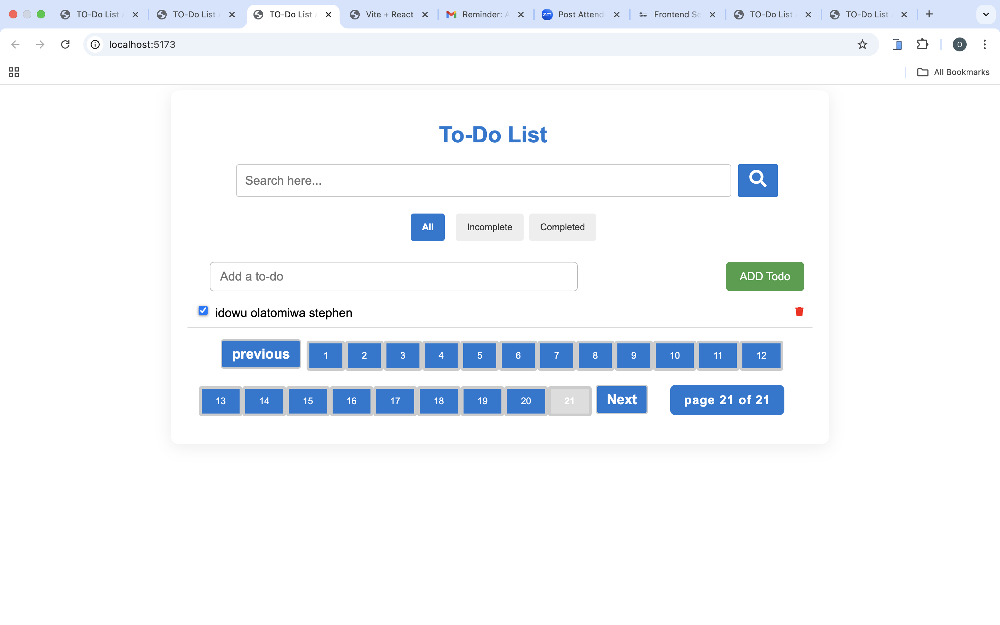
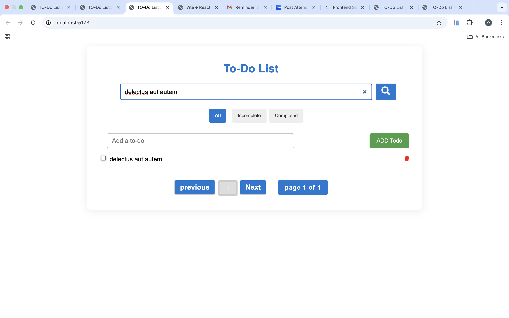
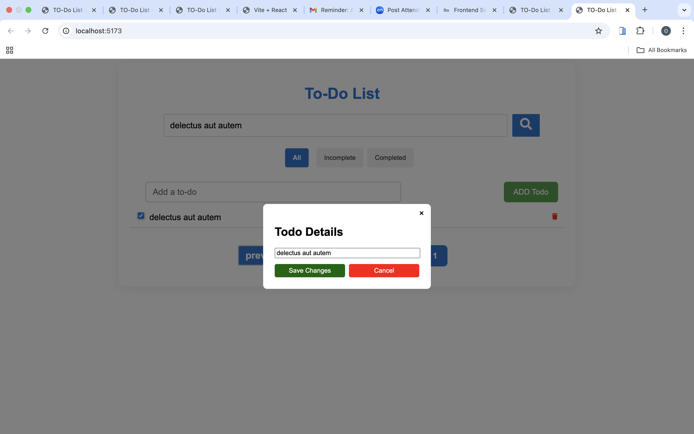
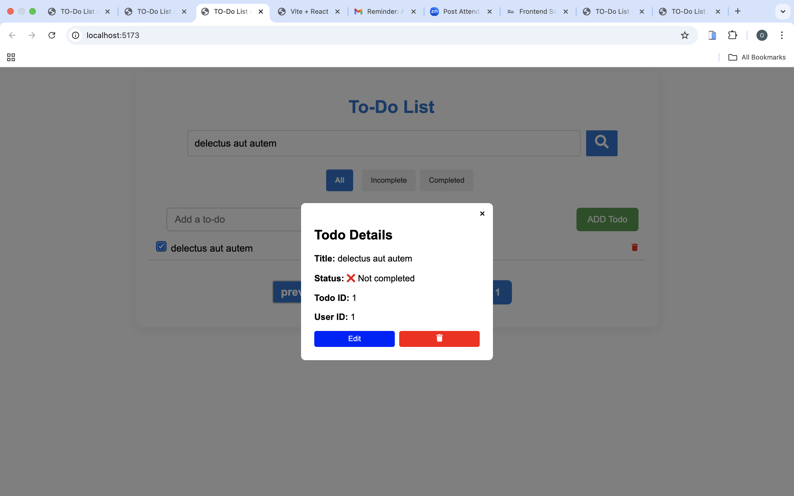
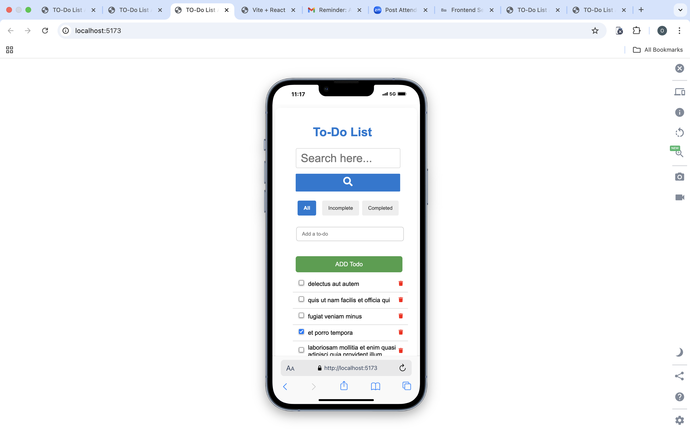
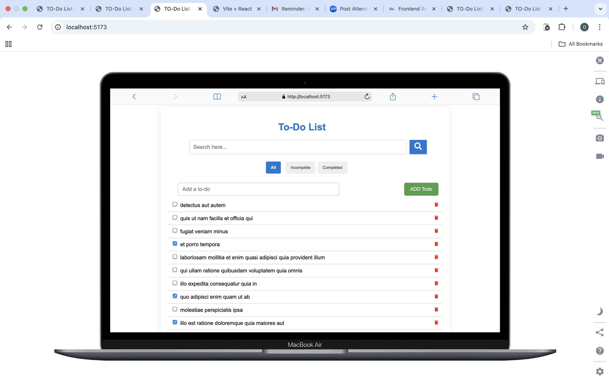

<<<<<<< HEAD

# Todo List App

This is a React-based to-do list application with filtering, searching, and pagination.

## All Features

- Add, edit, and delete to-do items
- Mark tasks as completed or pending
- Search tasks by title
- Filter by all, completed, or incomplete tasks
- Pagination for easy navigation
- Modal dialog for detailed task view and editing
- Error boundary for gracefull error handling
- Responsive design for mobile and desktop

## Screenshots

- 
- 
- 
- 
- 
- 

## Tech stack

- [React](https://react.dev/) (with hooks)
- [Vite](https://vitejs.dev/) for fast development and build
- [React Router](https://reactrouter.com/) for routing
- [React Query](https://tanstack.com/query/latest) for data fetching and caching
- [Axios](https://axios-http.com/) for HTTP requests
- [React Icons](https://react-icons.github.io/react-icons/) for UI icons

## Getting Started

### Prerequisites

- [Node.js](https://nodejs.org/) (v16 or higher recommended)
- [npm](https://www.npmjs.com/) or [yarn](https://yarnpkg.com/)

### Installation

**Install dependencies:**

```sh
npm install
```

### Running the App

start the development server:

```sh
npm run dev

Open [http://localhost:5173](http://localhost:5173) in your browser to view the app.
```

## Project Structure

```
src/
  App.jsx           # Main app component
  App.css           # App styles
  ErrorBoundary.jsx # Error boundary component
  main.jsx          # Entry point
  index.css         # Global styles
  assets/           # Static assets
public/
  vite.svg          # Vite logo
index.html          # HTML template
```

=======

# Todo-list-App

> > > > > > > 111f6d159fe7c5b7e9be5193f4c8d76610132223
